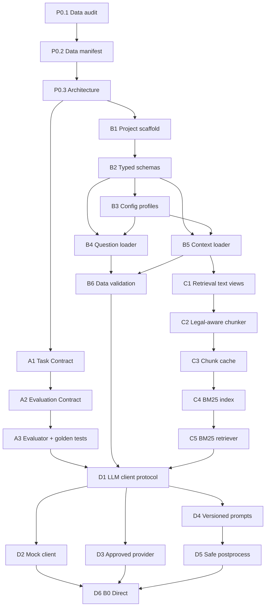

# Vietnamese Legal RAG-QA Target Architecture

**Task:** P0.3 - Define target architecture and task dependency graph  
**Status:** target design only; no implementation is changed by this document.  
**Principles:** small, typed, testable, deterministic, auditable, and data-safe.

## 0. Evidence and unresolved inputs

The task names three files that are not present under those exact paths:

- `docs/DATA_AUDIT.md` is absent. The available audit is `docs/integration-audit.md`.
- `docs/overview.pdf` is absent. The available task PDF is `docs/DSC2026_Task2_LegalQA_Data_Overview.pdf`.
- `docs/Huongdan.md` is absent. The available playbook is `docs/HUONG_DAN_DUNG_CODEX_XAY_DUNG_VIETNAMESE_LEGAL_RAG_QA_V1_0.md`.

`docs/DE_BAI_CUOC_THI.md` is also present and was read as the available task-contract source named by `AGENTS.md`.

The design below distinguishes observed facts from planned interfaces. Locally observed facts now include `data/train.json`, `data/warmup.json`, `data/public-official.json`, `data/selected-contexts.zip`, the data manifest, the task PDF, the playbook, `AGENTS.md`, and the submission contract. `private-official.json` and the official evaluator remain absent.

## 1. Design goals and non-goals

### Goals

- Keep the source data directory immutable and independently verifiable.
- Make B0 Direct, B1 BM25-RAG, and B2 Hybrid-RAG comparable under the same generator, split, evaluator, and artifact contract.
- Keep domain records typed and keep gold answers outside inference paths.
- Preserve legal-document provenance from source file through chunk, retrieval hit, evidence pack, prediction, and report.
- Make every derived cache and output reproducible from explicit fingerprints.
- Prefer small modules and deterministic local artifacts over infrastructure.

### Non-goals for the target baseline

- No vector database.
- No agents, multi-agent roles, memory, web search, or fine-tuning.
- No production loader implementation in this architecture task.
- No assumption that the missing official files have the same schema as warm-up until inspected.

## 2. Data flow

The common control flow is:

```text
read-only source files
  -> manifest gate
  -> typed validation and inference-safe views
  -> split/permission check
  -> selected-context corpus view
  -> optional normalization and legal-aware chunking
  -> retrieval strategy: none | BM25 | BM25 + semantic reranker
  -> provenance-preserving evidence packing
  -> provider-neutral generation client
  -> minimal answer postprocessing
  -> prediction/evidence/error artifacts
  -> evaluation or submission validation
```

Method-specific flow:

```text
B0 Direct:
question -> direct prompt -> generator -> cleaned answer

B1 BM25-RAG:
question -> BM25 over selected legal chunks -> dedup/pack evidence
         -> RAG prompt -> same generator -> cleaned answer

B2 Hybrid-RAG:
question -> BM25 rough candidate pool -> semantic reranker
         -> dedup/pack evidence -> same RAG prompt -> same generator
         -> cleaned answer
```

The generator must not receive the full question record or a model dump. It receives only the question string and, for RAG methods, a `PackedEvidence` value. Gold answers are evaluation/training inputs only when explicitly allowed by the split policy.

## 3. Module boundaries

The dependency direction is one-way: domain models and configuration are leaves; the CLI orchestrates the pipeline.

| Boundary | Responsibility | Must not do |
|---|---|---|
| `legal_rag.schemas` | Typed domain records and invariants. | Read files, call providers, or calculate metrics. |
| `legal_rag.config` | Validate profiles, resolve relative paths, redact secrets, compute config identity. | Read gold answers or create caches implicitly. |
| `legal_rag.data` | Read-only question/context access, schema validation, split permissions, source provenance. | Rewrite, normalize, rename, move, or extract into `data/`. |
| `legal_rag.text` | Derived retrieval text, Unicode/whitespace views, legal-aware chunking. | Mutate raw source text or create unsupported legal content. |
| `legal_rag.retrieval` | BM25 index/retriever and optional semantic reranker. | Read answers, public/private references, or call the generator. |
| `legal_rag.evidence` | Deduplicate hits and pack bounded evidence with included/dropped/truncated IDs. | Retrieve new facts or silently drop provenance. |
| `legal_rag.generation` | Client protocol, mock client, provider adapter, prompt builder, minimal postprocessing. | Retrieve, evaluate against gold, log chain-of-thought, or hide fallback. |
| `legal_rag.evaluation` | Strict prediction/reference alignment, METEOR/ROUGE-L adapters, per-case and aggregate metrics. | Feed references into inference or tune private data. |
| `legal_rag.submission` | Build/validate exact `submission.zip` layout, JSON fields, ID coverage, uniqueness, dataset ordering, and answer types. | Include internal metadata, evidence, scores, or gold fields. |
| `legal_rag.artifacts` | Run identity, fingerprints, atomic writes, summaries, errors, and redaction. | Write under `data/` or overwrite an unrelated run. |
| `legal_rag.cli` | Compose validated commands and fail with non-zero status on invalid state. | Contain retrieval/generation business logic. |

The current repository has only a scaffold/config/CLI and manifest script. The boundaries above are planned interfaces, not claims that these modules already exist.

## 4. Data models

Pydantic v2 models are the preferred implementation for externally loaded records and run contracts; small immutable dataclasses are appropriate for internal manifest/hash values.

| Model | Required fields | Gold/reference allowed? | Provenance or invariant |
|---|---|---:|---|
| `LegalQuestion` | `id: str`, `question: str`, optional `answer: str` | Only in approved train/evaluation view | ID normalized to string; question non-blank; deterministic ordering; `inference_view()` omits `answer`. |
| `LegalDocument` | `id: str`, `name: str`, optional `link`, `passage: str` | No | Source file, source archive/member if applicable, and content hash retained. The field set is documented by the PDF/playbook but not yet observed locally. |
| `LegalChunk` | `chunk_id`, `document_id`, `source_path`, `raw_text`, derived retrieval text | No | Section/article/clause labels, offsets where available, chunker version, and content hash. Raw text must be a substring or explicitly bounded rendering of source passage. |
| `RetrievalHit` | `chunk_id`, `rank`, `bm25_score` | No | Source provenance retained; optional `rerank_score` is separate from BM25 score; stable tie-break is `chunk_id`. |
| `PackedEvidence` | included hits/text, dropped IDs, truncated IDs, reasons | No | Bounded character/token budget; rendered evidence contains only retrieved legal text and provenance. |
| `Prediction` | `id`, `answer`, `method`, status/error metadata | No | No gold, reference, or hidden input fields; stable case order. |
| `CaseMetric` | `id`, METEOR, ROUGE-L, optional quality/error fields | Yes, evaluation artifact only | Strict ID alignment; duplicate/missing/extra IDs are explicit failures. |
| `EvaluationSummary` | split, metric versions, aggregates, counts | Yes, evaluation artifact only | Main metric METEOR, secondary ROUGE-L; official evaluator uncertainty remains visible. |
| `SubmissionRecord` | Legacy internal compatibility model | No | Official artifacts use the fixed `legal_rag.submission` ZIP contract. |
| `RunMetadata` | run ID, config/data/index/prompt/model fingerprints, environment, errors | No | Secrets redacted; no chain-of-thought; fallback reason explicit. |

### Observed source schema

Question files (`data/train.json`, `data/warmup.json`, `data/public-official.json`) are UTF-8 JSON objects/maps with numeric-looking string keys. Each value has exactly:

- `question: string`;
- `answer: string`.

Observed record counts: train 7000, warm-up 500, public 1000. Cross-split ID overlaps exist (`train`∩`warmup` 387, `warmup`∩`public` 40, `train`∩`public` 0).

`data/selected-contexts.zip` contains 8532 `context_*.json` members. Observed fields are `id` (integer), optional `name`, optional `link`, and `passage` (string). The loader indexes 8512 documents and excludes 20 blank-passage members with `BLANK_PASSAGE` warnings; when `name` is omitted, the loader uses deterministic fallback `str(id)`.

`private-official.json` is not locally available.

## 5. Read-only source paths

The following paths are source or specification inputs and must not be rewritten by loaders, indexers, evaluators, or run managers:

| Path | Role | Policy |
|---|---|---|
| `data/**` | Competition source data: `train.json`, `warmup.json`, `public-official.json`, `selected-contexts.zip`. | Read-only; no rename, move, normalization-in-place, extraction, or generated index. |
| `data/selected-contexts.zip` | Selected legal-context archive used by default configs. | Read-only; hash and read directly; never rewrite. |
| `selected-contexts.zip` | Optional root-level copy of the archive if later supplied. | Same read-only policy; configs default to `data/selected-contexts.zip`. |
| `AGENTS.md`, `docs/**` | Human-reviewed task/specification documents. | Read as configuration/specification; never treat prose examples as observed data. |
| `artifacts/data-baseline/manifest.json` | Integrity baseline for source data. | Versioned provenance artifact; update only through an intentional manifest review. |

The current manifest script hashes every file under `data/` and the optional root-level `selected-contexts.zip`, while excluding directory names `cache`, `output`, and `outputs`. The current checkout manifest covers four files under `data/`.

## 6. Cache paths

Caches are derived, disposable, and never inputs to the source-data manifest:

```text
cache/
  chunks/<source-manifest-hash>/<chunk-config-hash>/<cache-fingerprint>/chunks.jsonl
  indexes/bm25/<chunk-cache-fingerprint>/<index-fingerprint>/index.jsonl
  reranker/<model-fingerprint>/<candidate-fingerprint>/scores.jsonl
  retrieval/<run-or-config-fingerprint>/inspect.jsonl
```

Required cache rules:

- Cache keys include source manifest hash, relevant config hash, component version, and model/tokenizer identity where applicable.
- A stale or mismatched cache must fail or rebuild only through an explicit, documented mode; never silently reuse it.
- Cache writes are atomic and deterministic; JSONL or another auditable format is preferred over pickle.
- The chunk JSONL starts with a metadata record containing the complete fingerprint and summary, followed by typed chunk records in deterministic order.
- The BM25 JSONL starts with the complete chunk-cache/index/config fingerprint and corpus summary, followed by deterministic documents built only from `retrieval_text` token frequencies and provenance; it stores no `raw_text`, question, or answer fields.
- BM25 loading is strict by default. Rebuild is an explicit operation; an `auto_rebuild` mode must be selected and recorded by the caller rather than inferred from a mismatch.
- Cache content contains derived legal chunks/hits only. It must not contain gold answers, private references, or hidden submission labels.
- No vector database is introduced. B2 may score a bounded BM25 candidate pool with an optional semantic reranker and persist only auditable derived scores.

## 7. Output artifact paths

### Integrity artifact

```text
artifacts/data-baseline/manifest.json
```

This is not a model output and contains only source-relative paths, byte sizes, and SHA256 values plus manifest metadata.

### Per-run artifacts

```text
outputs/<run_id>/
  config.json
  environment.json
  run_summary.json
  predictions.jsonl
  retrieval.jsonl       # B1/B2 only
  generation.jsonl
  errors.jsonl
  metrics.json           # evaluation only
  submission.json        # internal run status; official package is submission.zip
```

`run_id` must be unique and encode or reference method/split/config identity without exposing secrets. Every file is written atomically, has stable ordering, and is tied to the source manifest hash. Inference artifacts must not include gold answers.

## 8. Direct baseline (B0)

**Purpose:** establish the generation/provider and output floor without retrieval.

Flow:

1. Load permitted question records.
2. Build an inference-safe question view.
3. Render a versioned direct prompt from the question only.
4. Call the same typed generator protocol used by RAG methods.
5. Apply only safe postprocessing: outer whitespace/line-ending cleanup and removal of known technical wrappers.
6. Preserve both `raw_answer` and `cleaned_answer` in the generation boundary,
   then write prediction and error artifacts in deterministic input order.

Constraints:

- No selected-context index is used.
- No answer/reference is available to the prompt, client, cache, or prediction artifact.
- Offline tests use a deterministic mock client.
- A provider error is either a case-level recorded failure (`fail_fast=false`) or a run failure (`fail_fast=true`); it is never silently converted to a fabricated answer.

## 9. BM25-RAG baseline (B1)

**Purpose:** add lexical legal evidence while holding generator and evaluation controls constant.

Flow:

1. Load only selected legal contexts for the legal index.
2. Create derived retrieval views and legal-aware chunks with provenance.
3. Build/load a fingerprinted BM25 index.
4. Use the question text only as the retrieval query.
5. Retrieve deterministic `rough_top_n` candidates; rank ties by `chunk_id`.
6. Deduplicate conservatively and pack `evidence_top_k` under a fixed budget.
7. Render the versioned RAG prompt with question plus `PackedEvidence`.
8. Call the same generator settings as B0.
9. Save prediction, retrieval, generation, error, and optional evaluation artifacts.

The BM25 corpus must never contain `answer`, public/private reference text, or any answer-derived field. B0 and B1 comparisons must use the same split, generator model, temperature, output budget, prompt version, and evaluator.

C5 retrieval artifacts use deterministic JSONL records with `schema_version`, question ID,
`query_sha256`, `index_fingerprint`, configured `top_k`, raw `RetrievalHit` records,
and explicit deduplication/packing metadata. The query text and gold answer are not
stored. `inspect-retrieval` prints the stable columns `rank`, `score`, `chunk_id`,
`document name`, `article/clause`, and a bounded raw-text preview.

## 10. Hybrid RAG baseline (B2)

**Target meaning:** BM25 candidate retrieval followed by an optional semantic reranker, not a vector database.

Flow:

```text
question
  -> BM25 rough_top_n
  -> semantic reranker over those candidates
  -> top evidence_top_k
  -> deduplication and evidence packing
  -> same RAG prompt and generator as B1
```

Controls:

- Preserve the BM25 score and store a separate reranker score.
- Record reranker model/version, device, truncation settings, latency, and fallback status.
- B2 changes retrieval ordering only; generator, prompt, evidence budget, split, and evaluator stay equal to B1.
- Unit tests use a mock reranker and never download a model.
- If `required=true`, unavailable or incompatible reranker state fails the run.
- If `required=false`, an explicit BM25 fallback is allowed only with `used=false` and a `fallback_reason` in run metadata; it must not be reported as an unqualified B2 result.
- No semantic index over questions or answers is permitted in this baseline.

## 11. Evaluation flow

```text
predictions.jsonl + approved references
  -> strict ID/duplicate/missing/extra validation
  -> evaluator-defined derived normalization
  -> per-case METEOR and ROUGE-L
  -> macro/aggregate summary with metric versions
  -> qualitative/error report only in evaluation scope
```

The task materials identify METEOR as the primary metric and ROUGE-L as secondary. The official tokenization, normalization, aggregation, and evaluator are unresolved until an official evaluator contract/script is supplied. The submission boundary is fixed separately and must not be conflated with evaluator equivalence. A local evaluator must therefore be labeled local and must not be treated as leaderboard-equivalent without golden equivalence checks.

References may be loaded only for an approved evaluation split. Private references must never enter prompt selection, retrieval/index construction, reranker tuning, threshold selection, or error-driven iteration.

## 12. Submission flow

```text
validated predictions
  -> question-dataset ID loader (dataset order only)
  -> fixed object-by-question-ID builder
  -> UTF-8 submission.json writer + parse-back validator
  -> exact single-member submission.zip packager + validator
  -> final submission.zip
```

The submission writer fails non-zero for missing, duplicated, extra, invalid, or out-of-order IDs, invalid answer types, malformed UTF-8/JSON, and wrong ZIP layout. It consumes only canonical prediction IDs/answers and never emits question text, evidence, scores, model metadata, or gold/reference values.

## 13. Leakage boundaries

| Boundary | Allowed | Forbidden |
|---|---|---|
| Source data | Read-only byte access and derived views | In-place rewrite, extraction into `data/`, normalization, rename, or move |
| Question inference view | `id`, question text, split/method metadata | Gold answer or reference fields |
| Legal index | Selected legal contexts only | Warm-up/train/public/private answers, answer-derived text, or web content |
| Retrieval query | Question text and its derived retrieval normalization | Gold answer, reference answer, or hidden labels |
| Prompt | Question plus retrieved evidence for RAG; question only for Direct | Full record dumps, references, chain-of-thought requests, or hidden metadata |
| Cache | Fingerprinted derived chunks, indexes, hits, and scores | Gold answers, private references, or unversioned cross-split state |
| Generation artifacts | Prediction text, status, latency, redacted metadata | Gold answer, reference text, or chain-of-thought |
| Tuning | Approved train/development/warm-up use under contract | Private test or repeated leaderboard feedback as a tuning loop |
| Submission | Official fields only | Internal IDs/metadata, retrieval traces, scores, or references |

## 14. Error and fallback boundaries

| Failure | Required behavior | Forbidden behavior |
|---|---|---|
| Manifest missing/mismatch | Fail before experiment; show missing, extra, or hash mismatch. | Continue with a warning. |
| Source/schema invalid | Fail validation with path and record context. | Skip malformed records silently. |
| Official context corpus absent | B1/B2 unavailable; B0 may still run. | Pretend an empty corpus is a successful RAG run. |
| Stale BM25/cache fingerprint | Fail or explicit rebuild command. | Silent rebuild or stale reuse. |
| Empty/invalid question | Contract-defined case error; preserve ID in error artifact. | Query with gold answer or fabricate a query. |
| Provider timeout/429/5xx | Retry only configured transient classes; record attempts. | Log secrets or retry permanent auth/config errors. |
| Case generation failure | `fail_fast=true` fails run; otherwise record error and continue. | Swallow exception or create an unmarked fallback answer. |
| Reranker unavailable | Required mode fails; optional mode falls back to BM25 with reason and method metadata. | Call fallback silently or claim a valid B2 result. |
| Evidence over budget | Deterministic drop/truncate policy with included/dropped/truncated IDs. | Drop context without provenance or retrieve new facts. |
| Evaluation alignment failure | Non-zero evaluation exit with ID diagnostics. | Score a partial or silently misaligned set. |
| Submission validation failure | Do not write an accepted submission; return non-zero. | Emit a best-effort file with unknown schema. |

## 15. Dependency graph P0-D

The requested graph covers the correctness foundation through the Direct baseline. Post-D retrieval/generation extensions are listed after it because BM25-RAG and Hybrid-RAG are defined by later playbook gates.



### Dependency interpretation

- P0.2 is the source-data gate for every later stage.
- A1 and A2 freeze what the data and evaluator mean; A3 prevents model comparison before metric behavior is tested.
- B2/B3 establish typed contracts/config before loaders and indexes.
- B4/B5 must pass before validation and chunking; C5 cannot exist before a validated context loader and deterministic chunk cache.
- D6 depends on the inference-safe question view, validated config, approved generator protocol, and evaluator contract. Direct generation does not depend on retrieval.

### Post-D method path

```text
D6 Direct
  -> E1 exact/overlap dedup
  -> E2 evidence budget packer
  -> E3 B1 BM25-RAG
  -> F1 reranker protocol
  -> F2 approved semantic reranker
  -> F3 B2 Hybrid-RAG
  -> G run manager/submission/self-check
  -> H leakage/split governance
  -> I experiment registry/error reports
```

E3 and F3 must retain the D6 generator/prompt contract and differ only in retrieval/evidence behavior for fair comparisons.

## 16. Expected files

This is a forward-looking file plan. It does not assert that the files exist today.

### Existing foundation to preserve

- `AGENTS.md`
- `pyproject.toml`
- `src/legal_rag/__init__.py`, `__main__.py`, `config.py`, `cli.py`
- `configs/default.yaml`
- `scripts/verify_data_manifest.py`
- `artifacts/data-baseline/manifest.json`
- `tests/test_smoke.py`, `tests/test_data_manifest.py`
- `docs/REPRODUCIBILITY.md`

### Documentation contracts

- `docs/ARCHITECTURE.md` — this document.
- `docs/DE_BAI_CUOC_THI.md` — available task description and metric summary; preserve as specification input.
- `docs/DATA_AUDIT.md` — create when the specified audit is available or rerun against official data.
- `docs/TASK_CONTRACT.md` — A1; exact input, split, output, and private-test rules.
- `docs/EVALUATION_CONTRACT.md` — A2; METEOR/ROUGE-L normalization and official-evaluator boundary.
- `docs/RETRIEVAL_CONTRACT.md` — B1/C5; chunk, score, tie, and provenance behavior.
- `docs/ERROR_TAXONOMY.md` — I2 diagnostics.
- `docs/IMPLEMENTATION_PLAN.md` and `docs/EXPERIMENT_LOG.md` — only if needed after contracts are approved.

### Small typed implementation surface

- `src/legal_rag/schemas.py`
- `src/legal_rag/data/questions.py`
- `src/legal_rag/data/contexts.py`
- `src/legal_rag/data/validation.py`
- `src/legal_rag/text/normalize.py`
- `src/legal_rag/text/chunking.py`
- `src/legal_rag/retrieval/bm25.py`
- `src/legal_rag/retrieval/reranker.py`
- `src/legal_rag/evidence/packing.py`
- `src/legal_rag/generation/protocol.py`
- `src/legal_rag/generation/mock.py`
- `src/legal_rag/generation/openai_compatible.py`
- `src/legal_rag/generation/prompts.py`
- `src/legal_rag/evaluation/metrics.py`
- `src/legal_rag/evaluation/alignment.py`
- `src/legal_rag/submission.py`
- `src/legal_rag/artifacts/run_manager.py`
- `src/legal_rag/cli.py` — extend the existing skeleton, not replace it.

### Commands/configs/tests

- `scripts/validate_data.py`
- `scripts/evaluate_predictions.py`
- `scripts/selfcheck.py`
- `configs/mock.yaml`, `direct.yaml`, `bm25_rag.yaml`, `hybrid_rag.yaml`
- `configs/prompts/direct_v1.txt`, `configs/prompts/rag_v1.txt`
- `tests/data/`, `tests/models/`, `tests/config/`, `tests/chunking/`, `tests/retrieval/`, `tests/generation/`, `tests/evaluation/`, `tests/submission/`

Do not create `vector_db/`, agent modules, or answer-example retrieval as part of the core P0-D/B0-B2 path.

## 17. Risks and alternatives

| Risk/uncertainty | Impact | Preferred control | Small alternative |
|---|---|---|---|
| Required audit/spec paths are missing | Architecture may encode an outdated contract. | Keep unresolved items explicit; create/approve task and evaluation contracts before loaders. | Use only the available audit/PDF/playbook as provisional evidence. |
| Official datasets and selected contexts are absent | B1/B2 cannot be validated or benchmarked. | Gate context loading/indexing on actual files and manifest update. | Run B0/mock and synthetic retrieval fixtures only. |
| Context schema is documented but unobserved | Loader assumptions can fail or discard provenance. | Inspect real records before implementing B5; fail closed on unknown fields/types. | Accept only a minimal adapter after human approval. |
| Official evaluator is unknown | Local score may be misleading. | Keep evaluator equivalence explicitly unresolved and add golden tests. | Use local metrics only for smoke tests, never leaderboard claims. |
| Python version conflict | `AGENTS.md` says Python 3.11+ while the existing scaffold targets Python 3.10. | Resolve before release and pin one supported interpreter in the project contract. | Keep modules compatible with both 3.10/3.11 until a decision is approved. |
| Vietnamese tokenization and legal codes | BM25 ranking may miss article numbers or diacritics. | Keep raw and retrieval views separate; test diacritics, dates, slashes, hyphens, and legal codes. | Start with conservative whitespace/token views before adding a segmenter. |
| Long passages and historical law | Truncation can remove controlling clauses or confuse current/previous rules. | Legal-aware chunking, parent headings, bounded evidence, version/effective-date provenance. | Use larger chunks only as a measured ablation. |
| Semantic reranker dependency | Model download, license, CPU latency, or incompatibility can block B2. | Protocol + mock first; explicit required/optional fallback and model fingerprint. | Use B1 BM25 as the stable fallback and report B2 unavailable. |
| Cache staleness | Old chunks/indexes can make runs irreproducible. | Fingerprint source manifest, config, component version, and model; atomic writes. | Disable cache for a small smoke run. |
| Provider/network failure | Incomplete or biased outputs can look like model behavior. | Mock E2E, typed retries, case errors, fail-fast configuration, redacted metadata. | Offline B0/B1/B2 mock runs for CI. |
| Metric mismatch with legal correctness | Lexical overlap may not reflect legal validity. | Keep METEOR/ROUGE-L plus retrieval/citation/error review; do not overclaim. | Add manual sampled review before any model decision. |
| Scope creep | Agents, vector DBs, fine-tuning, and web search increase leakage and maintenance risk. | Enforce module boundaries and task graph gates. | Implement only B0, B1, and optional reranked B2 with local artifacts. |

## 18. Architecture acceptance checklist

- [ ] Data flow has one common typed path and three explicit retrieval strategies.
- [ ] Source data, cache, output, and integrity-artifact paths are separated.
- [ ] Gold answers cannot cross into retrieval, prompts, inference caches, or inference artifacts.
- [ ] B0, B1, and B2 share generator/evaluator controls for fair comparison.
- [ ] BM25 and semantic reranking are local, auditable components; no vector database or agents.
- [ ] Errors fail closed or produce explicit, typed fallback metadata.
- [ ] P0-D dependencies and post-D B1/B2 method path are visible.
- [ ] Official-data, evaluator, and Python-version uncertainties are marked unresolved; submission contract is fixed and tested.
- [ ] Expected files are small, typed, and testable.
